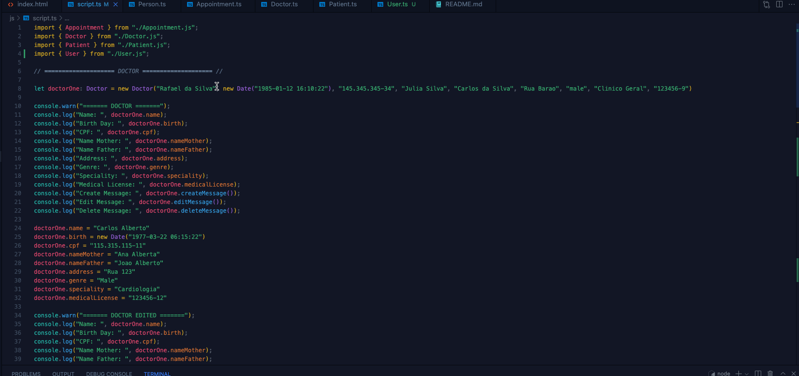
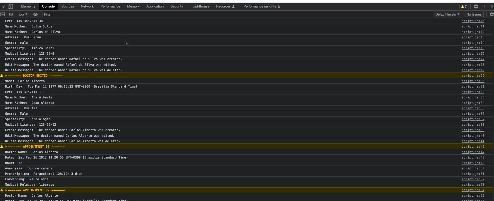

## Project EMR - Electronic Medical Record

---

## 🥠 About the project

It is a system used to manage the attendance of a clinic. It has functionalities to manage patients with their respective medical records, which in turn store their medical consultation.

 

---

## 🚀&nbsp; Challenge

Based on the project developed in Java, use the class diagram and write the inheritances in Typescript.
Must contain:
- Class
    - Attributes
    - Methods ===> No need to write the logic , but it must respect the standard return
    - Example
        - present:string can put
        - return "not yet implemented"
    - Heritage
    - Create objects to be displayed in log or on screen
    - The displayed data must be
        - The public attributes
        - return from methods that access private attributes
        - change attributes and redisplay in log

 

---

## 📈&nbsp;Class Diagram 
 

 

----
## 🔀&nbsp; Application flowchart 

The system flow is based on the concept:
- Patient ➡️ Medical Record ➡️ medical consultation 

    
<b>👈🽠&nbsp; Click here to expand the flowchart </b>

 

----

## ▶️&nbsp; Application in operation 

### The back-end version of the project developed in JAVA can be found [HERE](https://github.com/seiler-emerson/Entra21_Project_EMR_2022).

### The front-end version of the project developed in HTML/CSS can be found [HERE](https://github.com/seiler-emerson/Entra21_Project_EMR_Front_End_2022).
   

## 👨🏽‍🏫&nbsp; Instructions for execute the Project 

1. Make a project copy to your machine:
    - git clone https://github.com/seiler-emerson/Entra21_Project_EMR_Front_End_2022.git
    - Or a direct download from the page [HERE](https://github.com/seiler-emerson/Entra21_Project_EMR_Front_End_2022.git).
    - Import the project into your VSCode and open with live server plugin.
        - If you don't have VSCode installed, watch this video I recorded teaching you how to install it. [VIEW VIDEO](https://youtu.be/82GnguThEAQ).

 

---

## 👨🏻‍🎓&nbsp; Author 

 

<table>
<thead>
	<tr>
		<th>
            
        </th>
	</tr>
</thead>
<tbody>
	<tr>
		<td>
            
        </td>
	</tr>
</tbody>
</table>

 

---

